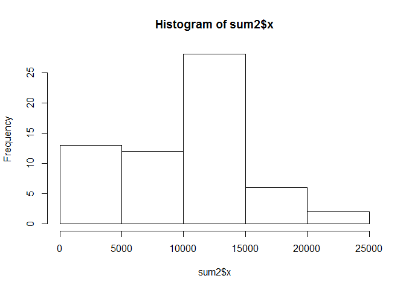
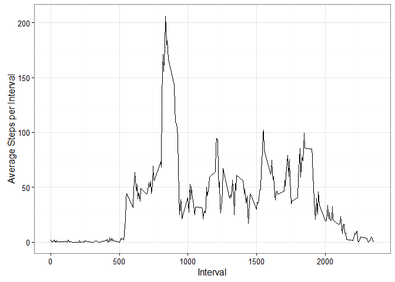
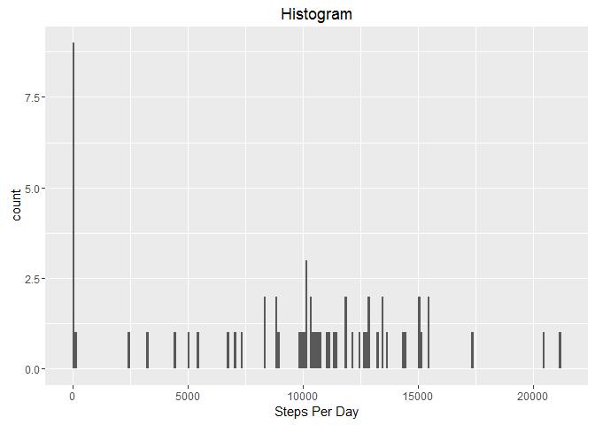
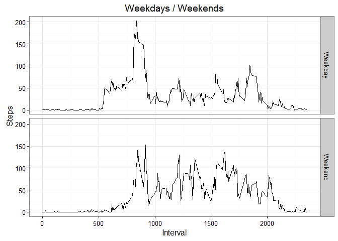

# Reproducible Research: Peer Assessment 1


## Loading and preprocessing the data


```r
mydata <- read.csv("activity.csv")
sum2 <- aggregate(mydata$steps, by=list(mydata$date), FUN=sum, na.rm = TRUE)
```

## What is mean total number of steps taken per day?

##sum of steps, histogram, mean and median 

```r
sum2 <- aggregate(mydata$steps, by=list(mydata$date), FUN=sum, na.rm = TRUE)
hist(sum2$x)
```



```r
mean(sum2$x)
```

```
## [1] 9354.23
```

```r
median(sum2$x)
```

```
## [1] 10395
```
## What is the average daily activity pattern?
##avg steps per interval, max

```r
library(ggplot2)
```

```
## Warning: package 'ggplot2' was built under R version 3.2.3
```

```r
avg1 <- aggregate(mydata$steps, by=list(mydata$interval), FUN=mean, na.rm = TRUE)
ggplot(avg1, aes(x = Group.1 , y = x)) + geom_line() + theme_bw() + xlab("Interval") + ylab("Average Steps per Interval")
```



```r
which.max(avg1[,2])
```

```
## [1] 104
```

## Imputing missing values
##number of missing values, mydata2 gets rid of them (replaces with 0)

```r
sum(is.na(mydata$steps))
```

```
## [1] 2304
```

```r
mydata[is.na(mydata)] <- 0
sum(is.na(mydata$steps))
```

```
## [1] 0
```

```r
mydata2 <- mydata[complete.cases(mydata),]
library(dplyr)
```

```
## Warning: package 'dplyr' was built under R version 3.2.3
```

```
## 
## Attaching package: 'dplyr'
```

```
## The following objects are masked from 'package:stats':
## 
##     filter, lag
```

```
## The following objects are masked from 'package:base':
## 
##     intersect, setdiff, setequal, union
```

```r
StepsPerDay <- mydata2 %>% group_by(date) %>% summarise(totalsteps=sum(steps))
ggplot(StepsPerDay, aes(x = totalsteps)) + geom_histogram(data = StepsPerDay, binwidth = 100) + xlab("Steps Per Day") + labs(title = "Histogram")
```



```r
mean(StepsPerDay$totalsteps)
```

```
## [1] 9354.23
```

```r
median(StepsPerDay$totalsteps)
```

```
## [1] 10395
```


## Are there differences in activity patterns between weekdays and weekends?


```r
DayofWeek <- function(x=vector()){
    dayNames <- strptime(x, format="%Y-%m-%d")
    dayNumbers <- as.numeric(format(dayNames, "%u"))
    weekendWeekday<- factor(dayNumbers <= 5, levels =c(TRUE, FALSE) , labels = c("Weekday", "Weekend"))
} 
NumStepsPerDay <- mydata2 %>% mutate(day1 = DayofWeek(date)) %>%
    group_by(interval, day1) %>% summarise(meansteps=mean(steps))

stepsplot <- ggplot(NumStepsPerDay, aes(x = interval, y = meansteps)) + geom_line() 

stepsplot +  facet_grid(day1 ~ .) + theme_bw() + ylab("Steps") + xlab("Interval") +
    labs(title = "Weekdays / Weekends")
```


